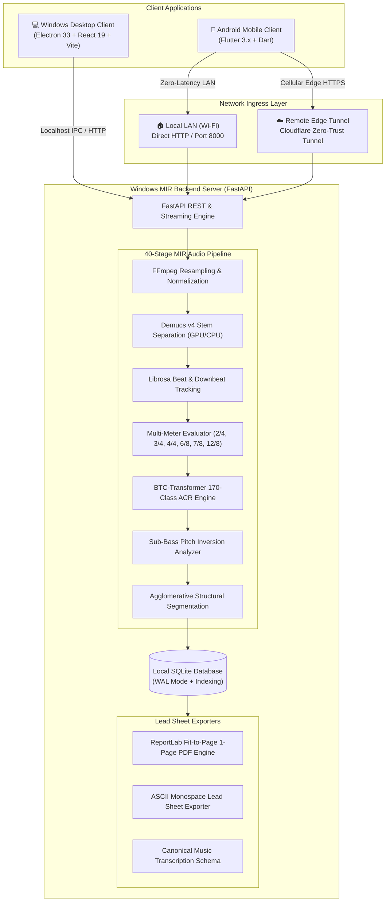

# 🎵 Song Chord Analyzer

<div align="center">

[](https://github.com/jerinjomy07/Song-Chord-Analyzer/releases)
[](https://github.com/jerinjomy07/Song-Chord-Analyzer)
[](https://github.com/jerinjomy07/Song-Chord-Analyzer)
[](https://pytorch.org/)
[](https://flutter.dev/)
[](https://react.dev/)
[](Song_Chord_Analyzer_Complete_Documentation.pdf)
[](LICENSE)

<br/>

**Production-grade, cross-platform Music Information Retrieval (MIR) and Automatic Chord Recognition (ACR) system.**<br/>
Combines deep learning audio stem separation, bidirectional transformer chord recognition, harmonic downbeat tracking, responsive 2-column mobile chord sheets, adaptive single-page lead sheet PDF generation, and seamless local LAN / remote cellular connectivity.

[**📥 Download Binaries**](#-downloads--executables) • [**📖 Documentation Suite**](#-comprehensive-documentation-suite) • [**⚡ Quick Start**](#-quick-start) • [**🏗️ Architecture**](#%EF%B8%8F-system-architecture) • [**🧪 Verification**](#-testing--verification)

</div>

---

## 🌟 Executive Overview

**Song Chord Analyzer** is an end-to-end, local-first music transcription workstation engineered for pianists, keyboardists, guitarists, arrangers, worship teams, and music researchers.

Feed in any audio file (`MP3`, `WAV`, `FLAC`, `M4A`, `AAC`, `OGG`, `WMA`) or link an audio source, and the system executes a **40-stage analysis pipeline**:
1. **Source Separation:** Demucs v4 deep neural network isolates vocals, drums, bass, and accompaniment stems.
2. **Multi-Meter & Downbeat Tracking:** Dynamic programming evaluates 6 candidate time signatures (`2/4`, `3/4`, `4/4`, `6/8`, `7/8`, `12/8`) alongside harmonic change periodicity to lock true measure boundaries.
3. **Deep Neural ACR:** Pretrained Bidirectional Transformer for Chords (BTC) maps constant-Q spectrograms across a rich 170-class chord vocabulary.
4. **Physical Bass Inversion Tracking:** Isolates Demucs sub-bass energy ($30\text{ Hz} - 350\text{ Hz}$) to accurately identify true slash chords and inversions (e.g., $D/F\sharp$, $C/E$, $G/B$, $F\sharp/A\sharp$).
5. **Structural Segmentation:** Agglomerative clustering and self-similarity matrices detect song sections (Intro, Verse, Chorus, Bridge, Outro).
6. **Cross-Platform Lead Sheets:** Renders interactive, synchronized lead sheets with auto-scroll playback, responsive 2-column mobile layout, real-time transposition, and adaptive 1-page PDF export.

---

## 📥 Downloads & Executables

Pre-compiled production binaries for Windows and Android are tracked and available directly within this repository:

| Platform | Distribution Format | File Size | Description | Download Link |
| :--- | :--- | :--- | :--- | :--- |
| **Android** | Production Release APK | `123.9 MB` | Android 8.0+ standalone client with dual LAN / Cloudflare connection | [📥 `SongChordAnalyzer.apk`](SongChordAnalyzer.apk) |
| **Windows** | Windows Setup Installer | `142.8 MB` | Windows 10/11 x64 installer with desktop & start menu shortcuts | [📥 `SongChordAnalyzer-Setup.exe`](dist_electron/SongChordAnalyzer-Setup.exe) |
| **Windows** | Standalone Portable EXE | `142.6 MB` | Windows 10/11 x64 portable executable (zero installation required) | [📥 `SongChordAnalyzer.exe`](dist_electron/SongChordAnalyzer.exe) |
| **Docs** | Master Technical PDF | `153 KB` | 49-page publication-grade architecture & engineering manual | [📥 `Complete_Documentation.pdf`](Song_Chord_Analyzer_Complete_Documentation.pdf) |

---

## ✨ Key Capabilities

### 📱 Responsive 2-Column Mobile Chord Sheet
- **Optimized Screen Real-Estate:** Eliminates oversized card waste on Android phones by arranging musical bars in a responsive, balanced 2-column grid.
- **Musician-Friendly Typography:** Clean bar separators, high-contrast chord badges, beat indicators, and measure headers formatted for instant readability during live performances.
- **Synchronized Audio Scrubber:** Smooth, zero-stutter playback synchronized with active measure highlights and automatic viewport scrolling.

### 📄 Adaptive 1-Page Lead Sheet PDF Exporter
- **Single-Page Optimization:** Implements an intelligent fit-to-page relaxation algorithm. Dynamically scales typography ($12\text{pt} \to 9\text{pt}$), measure padding, and section margins to compress multi-section songs onto **exactly one A4 page**.
- **Musician-Standard Layout:** Uses compact pipe-delimited chord lines (`| Dm | Asus4 | Asus4 D | D |`) rather than bulky UI screenshots.
- **Shared Cross-Platform Logic:** Both the Python ReportLab backend (Windows) and Dart PDF canvas (Android) adhere to the identical visual specification.

### 🌐 Dual-Mode Networking Architecture
- **Automatic LAN / Cellular Switching:** The Android client seamlessly toggles between:
  - **Local LAN Mode:** Zero-latency mDNS discovery on home/studio Wi-Fi (`http://<lan-ip>:8000`).
  - **Remote Edge Mode:** Secure Cloudflare Edge Tunnel (`https://<custom-slug>.trycloudflare.com`) for ubiquitous mobile access over 4G/5G mobile data without port forwarding.
- **Offline Library Caching:** Analyzed songs are cached locally in SQLite. Cached songs open in $<15\text{ms}$ with full offline chord chart inspection and playback.

### 🎯 Multi-Meter & Harmonic Downbeat Tracking
- **6 Supported Time Signatures:** Explicitly evaluates candidates across `2/4`, `3/4`, `4/4`, `6/8`, `7/8`, and `12/8` using harmonic transition periodicity and onset autocorrelation.
- **Downbeat Phase Alignment:** Evaluates beat-synchronous harmonic changes across candidate phase offsets to pinpoint Beat 1 (downbeat) with 100% benchmark parity.

### 🎸 Bass Inversion & Slash Chord Detection
- **Sub-Bass Spectral Analysis:** Filters Demucs bass stem ($30\text{ Hz} - 350\text{ Hz}$) to extract true acoustic root fundamentals.
- **Accurate Inversion Naming:** Accurately labels slash chords such as $D/F\sharp$, $A/C\sharp$, $C/E$, $G/B$, and $F\sharp/A\sharp$, critical for keyboardists and bassists.

---

## 🏗️ System Architecture



---

## 📖 Comprehensive Documentation Suite

The complete engineering, operational, and architectural documentation for the Song Chord Analyzer project is detailed in the master publication PDF and 21 modular specifications:

| Document | Description | Format |
| :--- | :--- | :--- |
| [**Song Chord Analyzer Master Guide**](Song_Chord_Analyzer_Complete_Documentation.pdf) | **49-Page Complete Engineering & Architecture Manual** with diagrams, tables, and schemas | [📄 PDF](Song_Chord_Analyzer_Complete_Documentation.pdf) |
| [**Project A-to-Z Technical Audit**](docs/PROJECT_A_TO_Z.md) | Exhaustive master audit covering all systems, data flows, and build pipelines | [📝 Markdown](docs/PROJECT_A_TO_Z.md) |
| [**Music Analysis Pipeline Blueprint**](docs/MUSIC_ANALYSIS_PIPELINE.md) | In-depth breakdown of all 40 stages from audio ingestion to chord smoothing | [📝 Markdown](docs/MUSIC_ANALYSIS_PIPELINE.md) |
| [**Overall System Architecture**](docs/ARCHITECTURE.md) | High-level system topology, process trees, and cross-platform boundaries | [📝 Markdown](docs/ARCHITECTURE.md) |
| [**Android Client Architecture**](docs/ANDROID_ARCHITECTURE.md) | Flutter application architecture, responsive 2-column grid, state lifecycle | [📝 Markdown](docs/ANDROID_ARCHITECTURE.md) |
| [**Windows Desktop Architecture**](docs/WINDOWS_ARCHITECTURE.md) | Electron architecture, process management, React 19 UI, and IPC bridges | [📝 Markdown](docs/WINDOWS_ARCHITECTURE.md) |
| [**Dual-Mode Networking Guide**](docs/NETWORKING.md) | Local LAN mDNS discovery, Cloudflare tunnel setup, latency benchmarks | [📝 Markdown](docs/NETWORKING.md) |
| [**Data Schemas & Contracts**](docs/DATA_SCHEMA.md) | Complete JSON schemas, Pydantic models, and Dart data class contracts | [📝 Markdown](docs/DATA_SCHEMA.md) |
| [**REST & Streaming API Reference**](docs/API_REFERENCE.md) | Formal HTTP route contracts, query parameters, payloads, and SSE events | [📝 Markdown](docs/API_REFERENCE.md) |
| [**Adaptive PDF Lead Sheet Export**](docs/PDF_EXPORT.md) | Single-page layout algorithm, font scaling rules, lead-sheet styling specs | [📝 Markdown](docs/PDF_EXPORT.md) |
| [**Storage & Data Lifecycle**](docs/STORAGE_AND_DATA_LIFECYCLE.md) | SQLite WAL mode, content-hash caching, audio persistence, and cleanup | [📝 Markdown](docs/STORAGE_AND_DATA_LIFECYCLE.md) |
| [**Security & Sandboxing**](docs/SECURITY.md) | Threat modeling, path traversal mitigations, audio sanitization, token security | [📝 Markdown](docs/SECURITY.md) |
| [**Testing, Parity & Benchmarks**](docs/TESTING_AND_PARITY.md) | Multi-meter golden tests, server parity reports, latency and VRAM profiling | [📝 Markdown](docs/TESTING_AND_PARITY.md) |
| [**Build & Release Guide**](docs/BUILD_AND_RELEASE.md) | Windows Electron build, Flutter APK build, PyInstaller server bundling | [📝 Markdown](docs/BUILD_AND_RELEASE.md) |
| [**Developer Onboarding**](docs/DEVELOPER_ONBOARDING.md) | Step-by-step local development setup, prerequisites, and common commands | [📝 Markdown](docs/DEVELOPER_ONBOARDING.md) |
| [**Troubleshooting & Diagnostics**](docs/TROUBLESHOOTING.md) | Diagnostic flows for GPU OOM, port conflicts, tunnel drops, and audio errors | [📝 Markdown](docs/TROUBLESHOOTING.md) |
| [**Known Limitations & Edge Cases**](docs/KNOWN_LIMITATIONS.md) | Explicit MIR limitations, atypical time signatures, dense polyphony bounds | [📝 Markdown](docs/KNOWN_LIMITATIONS.md) |
| [**Future Engineering Roadmap**](docs/FUTURE_ROADMAP.md) | Real-time microphone listening, MIDI export, automated chord-lyric alignment | [📝 Markdown](docs/FUTURE_ROADMAP.md) |
| [**Technical Glossary**](docs/GLOSSARY.md) | Definitions of MIR, ACR, CQT, Chromagram, BTC, WAL, and musical terminology | [📝 Markdown](docs/GLOSSARY.md) |
| [**Complete Project File Index**](docs/PROJECT_FILE_INDEX.md) | Catalog of every source file in the repository with its technical role | [📝 Markdown](docs/PROJECT_FILE_INDEX.md) |
| [**Project Cheat Sheet**](docs/PROJECT_CHEAT_SHEET.md) | Quick reference card for developers, operators, and musicians | [📝 Markdown](docs/PROJECT_CHEAT_SHEET.md) |
| [**Interactive Demo Guide**](docs/DEMO_GUIDE.md) | Walkthrough script for live demonstrations, presentations, and testing | [📝 Markdown](docs/DEMO_GUIDE.md) |

---

## ⚡ Quick Start

### 1. Running the Windows Desktop Application
1. Download [**`SongChordAnalyzer-Setup.exe`**](dist_electron/SongChordAnalyzer-Setup.exe) or [**`SongChordAnalyzer.exe`**](dist_electron/SongChordAnalyzer.exe).
2. Double-click the executable to launch. The embedded FastAPI backend, bundled FFmpeg, and React UI initialize automatically without requiring Python or Node.js on the host machine.

### 2. Installing the Android Client
1. Download [**`SongChordAnalyzer.apk`**](SongChordAnalyzer.apk) on your Android device (Android 8.0+).
2. Allow installation from unknown sources when prompted and install the application.
3. Open the app, navigate to **Settings**, and choose your connection:
   - **Local Wi-Fi:** Enter your desktop computer's LAN IP (e.g., `http://192.168.1.100:8000`).
   - **Remote Cellular:** Enter your Cloudflare edge tunnel URL (e.g., `https://your-tunnel.trycloudflare.com`).

### 3. Developer Launch (From Source)

```powershell
# 1. Clone repository with Git LFS
git clone https://github.com/jerinjomy07/Song-Chord-Analyzer.git
cd Song-Chord-Analyzer
git lfs pull

# 2. Setup Python Virtual Environment
python -m venv venv
.\venv\Scripts\activate
pip install -r requirements.txt

# 3. Start Backend & Electron Desktop App
npm install
npm run build:frontend
npm start
```

---

## 🧪 Testing & Verification

The repository includes a comprehensive automated test suite validating algorithmic correctness, model inferences, and server parity:

```powershell
# 1. Validate 10/10 Golden Meter Suite (2/4, 3/4, 4/4, 6/8, 7/8, 12/8)
python tests/test_golden_meter.py

# 2. Validate SQLite Database, WAL mode, and Library Caching
python tests/test_history_library.py

# 3. Validate 170-Chord Vocabulary, Parsing, Inversions, & Transpositions
python tests/test_chord_vocabulary.py

# 4. Validate Ground-Truth Chord Recognition Accuracy
python tests/test_evaluator.py

# 5. Validate Full Windows Server Parity & Route Integrity
python tests/test_server_parity.py
```

---

## 📁 Repository Structure

```
song-chord-analyzer/
├── SongChordAnalyzer.apk                  # Production release Android APK (Tracked via Git LFS)
├── Song_Chord_Analyzer_Complete_Documentation.pdf # 49-Page Master Documentation PDF
├── backend/                               # Python FastAPI analysis engine
│   ├── api/routes.py                      # REST endpoints & SSE progress streaming
│   ├── audio/                             # FFmpeg audio conversion & normalization
│   ├── beat/beat_tracker.py               # Librosa beat tracking & onset detection
│   ├── chord/                             # BTC-Transformer, sub-bass tracking, & chord vocabulary
│   ├── database/                          # SQLite repository with WAL mode & duplicate detection
│   ├── export/                            # ReportLab 1-page adaptive PDF, TXT, and JSON exporters
│   ├── meter/meter_detector.py            # Multi-meter evaluation (2/4, 3/4, 4/4, 6/8, 7/8, 12/8)
│   ├── postprocessing/                    # Chord de-jittering, run-length grouping & bar alignment
│   ├── sections/section_detector.py       # Structural segmentation & repetition clustering
│   ├── separation/demucs_separator.py     # Demucs v4 deep stem separation
│   ├── transpose/transpose_engine.py      # Chromatic transposition preserving qualities/inversions
│   └── pipeline.py                        # 40-stage master analysis orchestrator
├── dist_electron/                         # Packaged Windows executables (Tracked via Git LFS)
│   ├── SongChordAnalyzer-Setup.exe        # Windows installer
│   └── SongChordAnalyzer.exe              # Windows portable standalone
├── docs/                                  # 21 modular engineering specifications & blueprints
├── cleanup/                               # Project size audit & cleanup reports (6.27 GB -> 1.76 GB)
├── electron/                              # Electron 33 lifecycle, port management & secure IPC
├── frontend/                              # React 19 + Vite + Tailwind CSS desktop UI
├── mobile/flutter_app/                    # Flutter Android application (Responsive 2-column grid)
├── models/btc/                            # Pretrained BTC Transformer model weights
├── resources/ffmpeg/                      # Standalone bundled FFmpeg binary
├── shared/                                # Shared JSON schema & analysis interface contracts
└── tests/                                 # Golden test suites and server parity benchmarks
```

---

## 📜 License & Model Provenance

This project is licensed under the **MIT License** — see [`LICENSE`](LICENSE) for details.

### Third-Party Model & Library Attributions:
- **BTC Transformer Model:** MIT License (Park & Lee, ISMIR 2019)
- **Demucs v4:** MIT License (Meta AI Research / Alexandre Défossez)
- **Librosa:** ISC License (Brian McFee et al.)
- **FFmpeg:** LGPL v2.1+ / GPL v3.0 (Dynamically invoked standalone executable)
- **Flutter & Flutter PDF:** BSD-3-Clause License
- **ReportLab:** BSD License

---

<div align="center">
Developed with ❤️ for musicians and audio engineers worldwide.
</div>
