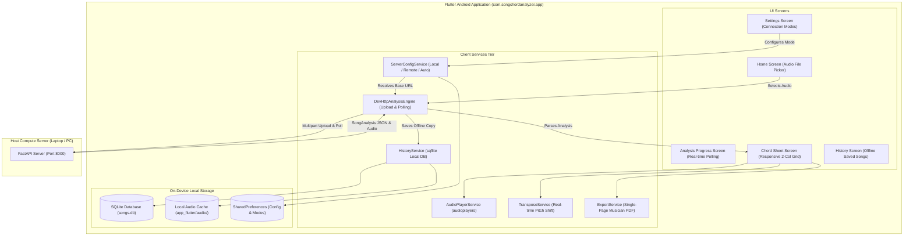

# Android Mobile Architecture Blueprint

## 1. Executive Architecture Overview

The Android application for Song Chord Analyzer is built with **Flutter / Dart** targeting Android 8.0+ (API level 26+). It operates as a high-performance, reactive presentation client backed by the authoritative Windows Python MIR server.

---

## 2. Screen-by-Screen Technical Reference

### 2.1 Home Screen (`HomeScreen`)
- **File:** `mobile/flutter_app/lib/screens/home_screen.dart`.
- **Purpose:** Primary application dashboard. Allows users to select an audio file, initiate analysis, view the active connection mode status pill, or jump to recent songs.
- **Widgets Used:** `ConnectionStatusBanner`, `ElevatedButton`, `RecentSongsList`, `FilePicker`.
- **Interactions:** Uses `file_picker` package to browse local device storage for `.mp3`, `.wav`, `.m4a`, and `.flac`. Upon selection, navigates to `AnalysisProgressScreen`.

### 2.2 Analysis Progress Screen (`AnalysisProgressScreen`)
- **File:** `mobile/flutter_app/lib/screens/analysis_progress_screen.dart`.
- **Purpose:** Visualizes real-time progress while the host server executes the 12-stage MIR pipeline.
- **State Management:** Polls `GET /api/analyze/{analysis_id}` every 500 ms using a repeating `Timer`.
- **UI Elements:** Circular progress indicator, percentage label (`0%` to `100%`), and localized stage description (`"Separating stems with Demucs..."`, `"Estimating beat grid..."`, etc.).
- **Completion Flow:** Upon receiving status `COMPLETED`, deserializes `SongAnalysis`, caches it in local SQLite via `HistoryService`, and navigates to `ChordSheetScreen`.

### 2.3 Chord Sheet Screen (`ChordSheetScreen`)
- **File:** `mobile/flutter_app/lib/screens/chord_sheet_screen.dart`.
- **Purpose:** Core musician interface displaying the interactive chord sheet.
- **Responsive Layout:** Automatically detects screen width. On mobile portrait devices ($< 600 	ext{ px}$), renders a high-density **2-column grid**; on tablets or landscape ($> 600 	ext{ px}$), expands to 4 columns.
- **Active Tracking:** Synchronizes with `AudioPlayerService` audio position stream. As music plays, highlights the active measure and active chord chip with an accent border and auto-scrolls the viewport to keep the playing bar in view.
- **Controls:** Floating audio player bar, transpose bottom sheet (`-11` to `+11` semitones), and export menu (PDF / TXT).

### 2.4 History Screen (`HistoryScreen`)
- **File:** `mobile/flutter_app/lib/screens/history_screen.dart`.
- **Purpose:** Displays all previously analyzed songs stored in on-device SQLite.
- **Offline Capability:** Operates **100% offline**. Users can open songs, play cached audio, transpose chords, and export PDFs without any connection to the laptop server.

### 2.5 Settings Screen (`SettingsScreen`)
- **File:** `mobile/flutter_app/lib/screens/settings_screen.dart`.
- **Purpose:** Controls network connection configuration across Local LAN, Remote Internet, and Auto modes. Includes real-time connection diagnostic probes measuring ping latency in milliseconds.

---

## 3. Custom Widgets & Presentation Components

- **`BarView` (`mobile/flutter_app/lib/widgets/bar_view.dart`):** Renders an individual musical bar. Displays bar number (e.g. `Bar 12`), time signature tag (`4/4`, `7/8`), and chord chips. Highlights with an orange border when the playback timeline enters the bar's `[start_time, end_time]` window.
- **`ChordTile` (`mobile/flutter_app/lib/widgets/chord_tile.dart`):** Displays an individual chord label (e.g. `Dm`, `C/E`). Renders a compact chip with distinct styling for the active playing chord.
- **`AudioPlaybackBar` (`mobile/flutter_app/lib/widgets/audio_playback_bar.dart`):** Fixed bottom player bar providing Play/Pause, Seek Slider, Elapsed/Total time counters, and playback speed controls (`0.75x`, `1.0x`, `1.25x`).
- **`ChordEditorModal` (`mobile/flutter_app/lib/widgets/chord_editor_modal.dart`):** Bottom sheet modal allowing musicians to manually override or correct individual chords.

---

## 4. Client Services Tier

### 4.1 ServerConfigService
- **File:** `mobile/flutter_app/lib/services/server_config_service.dart`.
- **Role:** Singleton ChangeNotifier managing server URLs and modes. Persists settings in `SharedPreferences`.
- **Connection Modes:**
  - `ConnectionMode.local`: Points to `http://192.168.x.x:8000`.
  - `ConnectionMode.remote`: Points to `https://*.trycloudflare.com`.
  - `ConnectionMode.auto`: Probes Local LAN first with 1.5s timeout; falls back to Remote if unreachable.
- **Diagnostics:** `testConnection(url, apiKey)` sends a `GET /api/health` request and returns status code, response payload, and round-trip ping time.

### 4.2 DevHttpAnalysisEngine
- **File:** `mobile/flutter_app/lib/services/dev_http_analysis_engine.dart`.
- **Role:** Implements the `AnalysisEngine` interface. Handles multipart file uploads, job queue polling, and deserialization of `SongAnalysis` JSON.

### 4.3 AudioPlayerService
- **File:** `mobile/flutter_app/lib/services/audio_player_service.dart`.
- **Role:** Wraps the `audioplayers` package. Emits continuous streams for `positionStream`, `durationStream`, and `playerStateStream`. Handles local file URIs as well as remote audio streaming URLs (`/api/analysis/{id}/audio`).

### 4.4 TransposeService
- **File:** `mobile/flutter_app/lib/services/transpose_service.dart`.
- **Role:** Pure client-side transposition engine. Takes a `SongAnalysis` object and semitone shift offset $k \in [-11, +11]$, recalculates all chord roots and slash bass notes using chromatic modular arithmetic, and preserves enharmonic spelling based on the transposed key tonic.

### 4.5 HistoryService
- **File:** `mobile/flutter_app/lib/services/history_service.dart`.
- **Role:** Local persistence layer using `sqflite`. Stores complete serialized `SongAnalysis` JSON strings alongside metadata in `songs.db`. Caches downloaded audio files in the device application documents directory.

### 4.6 ExportService
- **File:** `mobile/flutter_app/lib/services/export_service.dart`.
- **Role:** Vector PDF and plain text generator. Uses the Dart `pdf` package to construct the musician-grade lead sheet and executes the measurement-based Fit-to-Page algorithm to guarantee a single-page document.

---

## 5. Audit of Retired On-Device Kotlin Engine

In early development (Phase 2), on-device analysis was attempted in Kotlin (`mobile/flutter_app/android/app/src/main/kotlin/com/songchordanalyzer/app/`). This engine has been **formally retired and replaced by the server-backed architecture**.

### Why On-Device Analysis Was Retired:
1. **Demucs RAM Limitation:** Demucs stem separation requires > 2 GB RAM and heavy PyTorch tensor math. Mobile devices experienced frequent out-of-memory crashes (`java.lang.OutOfMemoryError`).
2. **CQT Filterbank Discrepancy:** The native Kotlin CQT implementation (`CqtExtractor.kt`) used an approximation that diverged from Librosa's CQT filterbank, resulting in degraded chord accuracy.
3. **Key Detection Tritone Bug:** In `KeyDetector.kt`, bin indexing `chroma[b % 12] += mag` on a 24-bin/octave CQT mapped bin 0 (C) and bin 12 (F#) to the same pitch class, completely scrambling key classification.
4. **Meter / Tempo Divergence:** The mobile Ellis beat tracker diverged from the Windows reference implementation on complex triple and additive meters.

**Current Status:** Kotlin source files are retained in the repository solely for historical documentation and potential future lightweight on-device experiments. Production analysis is 100% routed through the authoritative server.
