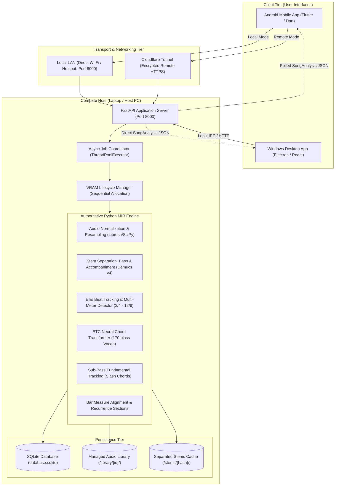
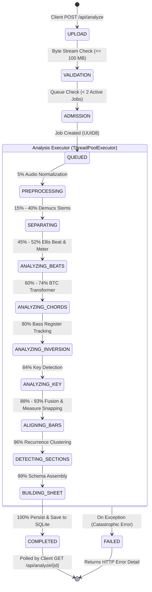

# System Architecture Blueprint

## 1. High-Level System Architecture

Song Chord Analyzer employs a **distributed client-server architecture** designed to separate resource-intensive Music Information Retrieval (MIR) and deep learning workloads from lightweight, responsive user interfaces.

---

## 2. Component Tier Responsibilities

### 2.1 Client Tier (Flutter Android & Electron Desktop)
- **Flutter Mobile Application (`mobile/flutter_app/`):**
  - Cross-platform presentation layer written in Dart.
  - Features a **responsive 2-column chord sheet grid**, interactive playback bar, real-time transposition engine, and local history management.
  - Communicates with the compute server via `DevHttpAnalysisEngine` using standard multipart HTTP uploads and polling.
  - Generates vector-rendered musician lead sheet PDFs directly on-device using the `pdf` package.
- **Electron Desktop Shell (`electron/`, `frontend/`):**
  - Native Windows desktop wrapper written in Node.js/Electron.
  - Spawns and manages the local Python engine (`run_app.py --no-browser`) as a child process.
  - Hosts the React/Vite web interface communicating over `localhost:8000`.

### 2.2 Server Tier (FastAPI REST Backend)
- **FastAPI Core (`backend/main.py`, `backend/api/routes.py`):**
  - Mounts on `0.0.0.0:8000` to accept connections from both local LAN IP addresses and remote reverse proxies.
  - Enforces request admission control via `MAX_ACTIVE_ANALYSES = 2` and upload payload caps (`MAX_UPLOAD_BYTES = 100 MB`).
  - Implements optional API key protection via `api_key_auth_middleware` checking the `X-API-Key` header.
  - Provides diagnostic and hardware health monitoring via `/api/health`.

### 2.3 Compute Pipeline Tier (Authoritative Python MIR Engine)
- **Execution Manager (`backend/pipeline.py`):**
  - Manages sequential stage execution and explicit GPU VRAM clearing (`VRAMManager.release_gpu()`) to run comfortably within 6 GB VRAM GPUs (e.g. NVIDIA RTX 3050).
  - Coordinates Librosa audio preprocessing, Demucs v4 stem isolation, multi-hypothesis tempo tracking, K-S key detection, BTC Transformer inference, sub-bass fundamental analysis, bar quantization, and structural section discovery.

### 2.4 Persistence Tier
- **Managed Library (`STORAGE_DIR/library/`):** Permanent storage for analyzed audio files.
- **Stem Cache (`STORAGE_DIR/stems/`):** Caches Demucs 4-stem separations by SHA-256 audio content hash, eliminating redundant computation.
- **Relational Metadata (`STORAGE_DIR/database.sqlite`):** Tracks song history, analysis IDs, metric parameters, and user favorites.

---

## 3. Server Process & Asynchronous Job Execution Model

Audio analysis is a computationally intensive, non-blocking operation coordinated via an in-memory job state machine:

1. **Submission (`POST /api/analyze`):** Audio is streamed in 64 KB chunks to a temporary file. If the file exceeds 100 MB, an immediate HTTP 413 is returned.
2. **Admission Control:** `active_in_flight` tasks are counted. If active tasks $\ge 2$, an HTTP 503 ("Analysis queue is full") is returned.
3. **Task Queueing:** An 8-character UUID is generated, and a job status object initialized in `ACTIVE_TASKS`.
4. **Execution:** The job is submitted to `ANALYSIS_EXECUTOR = ThreadPoolExecutor(max_workers=1)`. Single-threaded worker execution prevents GPU memory thrashing.
5. **Polling:** The client polls `GET /api/analyze/{analysis_id}` every 500ms to update the mobile progress bar and status message.
6. **Completion:** Upon reaching 100%, the full `SongAnalysis` object is saved to the SQLite repository and cached in `ANALYSIS_RESULTS`.

---

## 4. Single Points of Failure & Resilience Analysis

| Component | Failure Mode | Impact | Mitigation / Recovery |
|---|---|---|---|
| **Host Laptop / PC** | Power off, sleep, or network disconnect | Analysis unavailable; remote & local modes fail | Once analyzed, songs are cached in phone SQLite for offline playback and PDF export. |
| **FastAPI Backend** | Process crash or unhandled exception | Mobile app reports "Connection Error" | Electron automatically restarts process up to 3 times; manual restart via `run.bat` or `python run_app.py`. |
| **GPU / CUDA** | Out of Memory (OOM) or driver crash | Analysis crashes during Demucs or BTC | `VRAMManager` flushes GPU between stages (`torch.cuda.empty_cache()`); CPU fallback automatically engages if CUDA unavailable. |
| **Cloudflare Tunnel** | Process termination or tunnel token expiry | Remote cellular analysis fails; Local LAN unaffected | Script `start_tunnel.bat` provides instant 1-click re-connection; mobile auto-switches to Local LAN if on Wi-Fi. |
| **Storage / Disk** | Disk full in AppData | Stems cannot be cached; job fails | Configurable data directory via `SONG_CHORD_ANALYZER_DATA_DIR`; automated cleanup scripts. |

---

## 5. Source Code Quality & Structural Coupling Map

### High-Stability / Authoritative Modules
- `backend/meter/meter_detector.py`: Mathematically verified across 10/10 golden meter fixtures for all 6 time signatures.
- `backend/chord_recognition/btc_recognizer.py`: Robust Transformer neural inference engine with deterministic token mapping.
- `shared/music_schema/song_analysis.schema.json`: Strict JSON schema contract guaranteeing cross-platform data compatibility.
- `mobile/flutter_app/lib/services/export_service.dart`: Self-contained vector PDF exporter with adaptive measurement scaling.

### High-Complexity / Sensitive Modules (Modify with Extreme Caution)
- `backend/pipeline.py`: Central orchestrator tightly coupling VRAM management, stem caching, and 12 distinct signal processing steps.
- `backend/postprocessing/alignment.py`: Bar quantization engine responsible for temporal snapping and boundary blip elimination.
- `mobile/flutter_app/lib/screens/chord_sheet_screen.dart`: Core UI controller managing synchronized audio playback, auto-scroll offsets, transpose calculations, and responsive grid layout.

### Retired / Legacy Modules (Preserved for Research)
- `mobile/flutter_app/android/app/src/main/kotlin/`: Historical on-device Kotlin analysis engine (retired due to Demucs RAM limits and CQT filterbank divergence).
