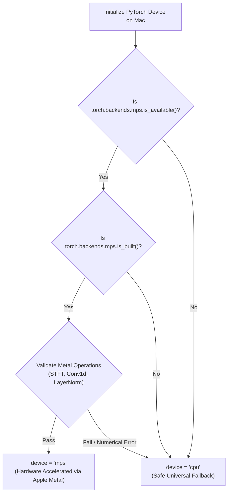

# 🍎 Song Chord Analyzer — macOS Compatibility & Architecture Audit

<div align="center">

**Document Version:** 1.0.0  
**Target Platform:** macOS 12.0+ (Monterey, Ventura, Sonoma, Sequoia)  
**Primary Architecture:** Apple Silicon (ARM64: M1 / M2 / M3 / M4)  
**Secondary Architecture:** Intel x86_64 (Rosetta 2 / Universal Binary)  
**Status:** Complete Technical Audit  
**Authoritative Reference:** Windows Reference Implementation (v1.0.0)

</div>

---

## 1. Executive Summary & Objective

This audit evaluates the feasibility, structural requirements, dependency availability, and engineering steps necessary to port **Song Chord Analyzer** from its current Windows desktop and Android client architecture into a **native, standalone, offline macOS desktop application** distributed as a `.dmg` installer or `.zip` application bundle (`Song Chord Analyzer.app`).

### Non-Negotiable Porting Invariants:
1. **Local-First & Offline:** The Mac application must analyze audio files locally on the Mac. It must **not** require a running Windows PC, a remote FastAPI server, Cloudflare Tunnels, or internet access for new song analyses once installed with required dependencies and models.
2. **Musical Parity:** The trusted MIR algorithms, 170-class chord vocabulary, Demucs stem separation, BTC Transformer inference, sub-bass physical inversion tracking, multi-meter evaluation (`2/4`, `3/4`, `4/4`, `6/8`, `7/8`, `12/8`), and bar alignment must remain algorithmically identical to the Windows reference. No simplified "toy" chord recognizer may be substituted.
3. **Desktop Experience:** The user interface must preserve the rich React 19 + Tailwind desktop experience with compact chord sheets, synchronous playback scrubbing, auto-scrolling, inline chord editing, semitone transposition, and ReportLab adaptive 1-page PDF export.
4. **Current Host Environment Notice:** The active local workstation is Windows 11 x64. All codebase abstractions, cross-platform path handling, engine interfaces, packaging manifests, and launch scripts in this audit are authored to compile and package on macOS. Physical `.dmg` binary assembly, Apple Gatekeeper notarization, and runtime Metal GPU validation require an actual macOS host or an automated Apple Silicon CI runner (e.g. GitHub Actions `macos-14`).

---

## 2. Component-by-Component Compatibility Audit

Every major subsystem, module, and dependency in the Song Chord Analyzer repository has been audited against macOS and Apple Silicon (ARM64) constraints.

### Classification Taxonomy:
- **Compatible:** Works on macOS out of the box with zero code changes.
- **Compatible with configuration changes:** Code logic is sound; requires POSIX/macOS path, environment, or command-line adjustments.
- **Requires a macOS-specific implementation:** Windows-only construct (e.g. `cmd.exe`, `taskkill`, `ctypes.windll`, `.ico`, `.bat`) requiring a native macOS equivalent (`launchd`, `pkill`, `.icns`, `.sh`, POSIX signals).
- **Requires a dependency replacement:** Windows binary (`ffmpeg.exe`, `python.exe`) that must be replaced by a native macOS Mach-O executable.
- **Requires hardware testing:** Algorithmically portable, but performance, Metal Performance Shaders (MPS) stability, or memory overhead requires empirical measurement on physical Apple Silicon hardware.
- **Unknown:** Undetermined behavior requiring runtime tracing.

---

### Audit Matrix

| # | Subsystem / Component | Current File / Location | Classification | macOS Porting Requirements & Strategy |
| :--- | :--- | :--- | :--- | :--- |
| **1** | **Electron Shell Lifecycle** | `electron/main.cjs` | **Compatible with configuration changes** | Update `resolvePythonExecutable()` to find POSIX Python (`bin/python3`). Replace `taskkill` with POSIX process group signals (`process.kill(-pid, 'SIGTERM')`). Configure macOS window frame (`titleBarStyle: 'hiddenInset'`). |
| **2** | **Electron Preload IPC** | `electron/preload.cjs` | **Compatible** | Uses standard Electron `contextBridge` and `ipcRenderer`. 100% portable across Windows, macOS, and Linux. |
| **3** | **React Desktop UI** | `frontend/src/` | **Compatible** | Pure React 19 + Vite + Tailwind CSS + Lucide Icons. Renders in Electron Chromium 130 on macOS with identical visual fidelity. |
| **4** | **FastAPI Server Entrypoint** | `backend/main.py`, `run_app.py` | **Compatible with configuration changes** | Change Windows default paths and subprocess launches. Uvicorn loopback binding (`127.0.0.1`) and static file serving function identically on macOS. |
| **5** | **Analysis Engine Contract** | `shared/analysis_contracts/analysis_engine.py` | **Compatible** | Abstract `IAnalysisEngine` interface is platform-agnostic. Both Windows and Mac engines adhere strictly to this contract. |
| **6** | **Engine Implementation** | `backend/engine/windows_engine.py` | **Requires a macOS-specific implementation** | Create `MacOSAnalysisEngine` (or unified `DesktopAnalysisEngine`). Wraps `SongAnalyzerPipeline` and `SongAnalysis` models identically without Windows-specific assumptions. |
| **7** | **Master Analysis Pipeline** | `backend/pipeline.py` | **Compatible with configuration changes** | Support Apple Silicon Metal GPU (`mps`) device alongside `cpu`. Update `VRAMManager` to call `torch.mps.empty_cache()` where available. All 40 analysis stages remain identical. |
| **8** | **Application Paths & Config** | `backend/config.py` | **Requires a macOS-specific implementation** | On macOS, resolve `STORAGE_DIR` to `~/Library/Application Support/SongChordAnalyzer/` instead of `%LOCALAPPDATA%`. Remove Windows `ctypes.windll` memory call; use `psutil` or `sysctl`. |
| **9** | **FFmpeg Audio Transcoder** | `resources/ffmpeg/ffmpeg.exe`, `backend/audio/ffmpeg_utils.py` | **Requires a dependency replacement** | Replace 163 MB Windows `ffmpeg.exe` with a native macOS static binary (`ffmpeg` Mach-O universal/arm64) or fallback to Homebrew `/opt/homebrew/bin/ffmpeg`. |
| **10** | **Python Runtime** | `resources/python/` | **Requires a dependency replacement** | Replace Windows Python embeddable bundle with a macOS standalone runtime (e.g. Python Standalone Build `cpython-3.11.*-aarch64-apple-darwin` or pyinstaller bundle). |
| **11** | **BTC Transformer Model** | `models/btc/btc_model_large_voca.pt`, `backend/chord/btc.py` | **Compatible** | PyTorch neural network checkpoint (`12.2 MB`) is cross-platform. Loads via `torch.load(..., map_location=device)` on CPU and Apple Silicon MPS. |
| **12** | **Demucs v4 Stem Separation** | `backend/separation/demucs_separator.py`, `separate.py` | **Requires hardware testing** | Pure Python package utilizing PyTorch. Runs on Apple Silicon ARM64. Must verify MPS acceleration vs CPU fallback stability for `htdemucs` STFT operations. |
| **13** | **Audio Preprocessing** | `backend/audio/preprocessor.py` | **Compatible** | Decodes via FFmpeg/soundfile; normalizes dynamics via NumPy. 100% portable. |
| **14** | **CQT & Chroma Extraction** | `backend/chord/chroma.py`, `librosa` | **Compatible** | Constant-Q Transform via Librosa / SciPy. Uses native Accelerate framework or FFTW under macOS ARM64. |
| **15** | **Beat & Downbeat Tracker** | `backend/beat/beat_tracker.py` | **Compatible** | Dynamic programming beat tracker via Librosa. Pure NumPy algorithms, 100% portable. |
| **16** | **Multi-Meter Detection** | `backend/meter/meter_detector.py` | **Compatible** | 6-candidate meter detection (`2/4`, `3/4`, `4/4`, `6/8`, `7/8`, `12/8`) using onset autocorrelation. 100% portable. |
| **17** | **Key & Mode Estimation** | `backend/key/key_detector.py` | **Compatible** | Krumhansl-Schmuckler chroma correlation. Pure algorithmic NumPy implementation. |
| **18** | **Sub-Bass Inversion Tracker** | `backend/chord/bass.py`, `vocabulary.py` | **Compatible** | Filters Demucs bass stem ($30-350\text{ Hz}$) for acoustic fundamental frequencies. 100% portable. |
| **19** | **Ensemble Evidence Fusion** | `backend/chord/ensemble.py` | **Compatible** | Multi-source Bayesian fusion and harmonic simplicity penalty. Pure Python math. |
| **20** | **Bar Alignment & Smoothing** | `backend/postprocessing/alignment.py`, `smoothing.py` | **Compatible** | Run-length consolidation and bar boundary snapping. Pure algorithmic logic. |
| **21** | **Section Detection** | `backend/sections/section_detector.py` | **Compatible** | Agglomerative clustering on Librosa recurrence matrices. 100% portable. |
| **22** | **Canonical Music Schema** | `shared/music_schema/song_analysis.schema.json` | **Compatible** | Universal JSON Schema. Authoritative contract shared across Windows, macOS, and Android. |
| **23** | **SQLite History Database** | `backend/database/db.py`, `repository.py` | **Compatible with configuration changes** | Python `sqlite3` with WAL mode is standard on macOS. Path redirected to macOS Application Support directory. |
| **24** | **ReportLab 1-Page PDF** | `backend/export/pdf_exporter.py` | **Compatible** | ReportLab is pure Python. Generates identical publication-grade lead sheet PDFs on macOS. |
| **25** | **ASCII TXT & JSON Export** | `backend/export/txt_exporter.py`, `json_exporter.py` | **Compatible** | Platform-agnostic file writers. |
| **26** | **Electron Builder Config** | `electron-builder.yml` | **Requires a macOS-specific implementation** | Add `mac` target (`dmg`, `zip`), category, entitlements (`entitlements.mac.plist`), and icon (`build/icon.icns`). |
| **27** | **Code Signing & Notarization**| `electron/sign-noop.cjs` | **Requires a macOS-specific implementation** | macOS Gatekeeper requires code signing with an Apple Developer ID certificate and notarization via `notarytool` for public distribution. Ad-hoc signing supported for local builds. |

---

## 3. macOS Target Architecture & Specifications

### 3.1 Primary Target: Apple Silicon (ARM64)
- **Chips Supported:** Apple M1, M1 Pro, M1 Max, M1 Ultra, M2, M2 Pro, M2 Max, M2 Ultra, M3, M3 Pro, M3 Max, M4.
- **Why Apple Silicon First:**
  - Modern Mac market share is overwhelmingly Apple Silicon.
  - Unified Memory Architecture (UMA) provides massive memory bandwidth ($68\text{ GB/s} - 800\text{ GB/s}$) shared directly between CPU and GPU.
  - PyTorch features native Metal Performance Shaders (MPS) acceleration, enabling GPU stem separation and BTC transformer inference without dedicated NVIDIA CUDA hardware.

### 3.2 Secondary Target: Intel x86_64 Macs
- **Legacy Compatibility:** Intel Macs (2015–2020) with Core i5/i7/i9 processors.
- **Execution Mechanism:**
  - **Rosetta 2:** ARM64 builds can be run on Intel Macs only via Universal 2 binaries, or a separate `x64` build target can be generated by Electron Builder (`arch: [arm64, x64]`).
  - **PyTorch on Intel macOS:** Intel Macs do not support Metal MPS in older PyTorch versions and have no NVIDIA CUDA. They must run the MIR pipeline on **CPU**.
  - **Performance Expectation:** Demucs v4 stem separation on a 4-core Intel Core i5 takes $\sim 45-75\text{ seconds}$ per song on CPU, whereas an M1/M2 Mac executes it in $\sim 8-15\text{ seconds}$.

### 3.3 Target Operating System & System Requirements

| Parameter | Minimum Requirement | Recommended Specification |
| :--- | :--- | :--- |
| **Operating System** | macOS 12.0 Monterey | macOS 14.0 Sonoma / macOS 15.0 Sequoia |
| **Processor** | Apple Silicon M1 (8-core) or Intel Core i5 (4-core) | Apple Silicon M2 / M3 / M4 (Unified Memory) |
| **System Memory (RAM)** | 8 GB Unified Memory / RAM | 16 GB Unified Memory |
| **Free Storage Space** | 3.5 GB (App bundle + Python runtime + AI models) | 10 GB (for caching separated audio stems) |
| **Display Resolution** | $1280 \times 800$ | $1920 \times 1080$ or Retina Display |
| **Python Compatibility** | Python 3.10.x – 3.11.x (ARM64) | Python 3.11.x (Optimized CPython ARM64) |
| **Electron Runtime** | Electron 33.2.1 (Chromium 130 / Node 20.18) | Electron 33.2.1 Universal or ARM64 |

---

## 4. Hardware Acceleration Strategy: Apple Metal (MPS) vs CPU Fallback

Unlike Windows, where Song Chord Analyzer leverages NVIDIA CUDA on dedicated GPUs (e.g. RTX 3050), macOS utilizes **Apple Metal Performance Shaders (MPS)**:



### Safety and Parity Rules for MPS:
1. **Never Compromise Musical Accuracy:** If an MPS operation in PyTorch produces NaN, Inf, or numerical divergence during Demucs or BTC CQT processing, the pipeline must dynamically fall back to `device = "cpu"`.
2. **Identical Model Weights:** Both MPS and CPU modes load the exact same model checkpoint (`btc_model_large_voca.pt` and Demucs `htdemucs`).
3. **Memory Management on macOS:** Apple Silicon unified memory is shared with the operating system. `torch.mps.empty_cache()` and Python `gc.collect()` must be called between Demucs stem separation and BTC transformer loading, maintaining the identical strict sequential VRAM lifecycle enforced on Windows.

---

## 5. macOS File System & Data Storage Architecture

On macOS, files must be stored according to Apple's Human Interface Guidelines and Sandbox rules:

| Storage Role | Windows Reference Path | macOS Implementation Path |
| :--- | :--- | :--- |
| **Application Support Root** | `%LOCALAPPDATA%\SongChordAnalyzer\` | `~/Library/Application Support/SongChordAnalyzer/` |
| **SQLite History Database** | `%LOCALAPPDATA%\...\database.sqlite` | `~/Library/Application Support/SongChordAnalyzer/database.sqlite` |
| **AI Model Weights** | `%LOCALAPPDATA%\...\models\` | `~/Library/Application Support/SongChordAnalyzer/models/` *(or inside `.app/Contents/Resources/models/`)* |
| **Stem Cache (Demucs)** | `%LOCALAPPDATA%\...\stems\` | `~/Library/Application Support/SongChordAnalyzer/stems/` |
| **Song Audio Library** | `%LOCALAPPDATA%\...\library\` | `~/Library/Application Support/SongChordAnalyzer/library/` |
| **Temporary Processing** | `%LOCALAPPDATA%\...\temp\` | `~/Library/Caches/SongChordAnalyzer/temp/` |
| **Exported Files** | `%LOCALAPPDATA%\...\exports\` | `~/Downloads/` *(or user-selected save destination)* |
| **Server Log Files** | `%LOCALAPPDATA%\...\server.log` | `~/Library/Logs/SongChordAnalyzer/server.log` |

---

## 6. Process Tree & Backend Lifecycle on macOS

The macOS desktop application manages its local Python backend using an isolated POSIX process tree:

```
[macOS Window Server / LaunchServices]
       │
       ▼
Song Chord Analyzer.app/Contents/MacOS/Song Chord Analyzer (Electron Main PID)
       │
       ├─► (POSIX fork/exec with process group PGID)
       │   └── Python 3.11 Backend (Uvicorn / FastAPI on 127.0.0.1:FREE_PORT)
       │         ├── FFmpeg (Subprocess spawned for audio decoding)
       │         └── PyTorch MPS / CPU ThreadPool
       │
       ├─► Splash Window (Renderer PID)
       └─► Main Window (Chromium Renderer PID, loads http://127.0.0.1:FREE_PORT)
```

### Shutdown and Clean Termination:
- On Windows, `taskkill /pid ${pid} /T /F` is used.
- On macOS, Electron spawns Python with `{ detached: true }` and calls `process.kill(-pythonProcess.pid, 'SIGTERM')` on window close or `app.on('before-quit')`. This guarantees that all child processes (Python, FFmpeg, Uvicorn workers) are cleanly destroyed without leaving zombie processes.

---

## 7. Packaging & Distribution Plan for macOS

### Distribution Formats:
1. **`.dmg` (Apple Disk Image):** Standard drag-and-drop installer containing `Song Chord Analyzer.app` and a symlink to `/Applications`.
2. **`.zip` Distribution:** Portable standalone archive for direct decompression and execution without mounting a disk image.

### Code Signing & Apple Gatekeeper:
- **Local / Developer Builds:** Signed ad-hoc (`identity: null` in `electron-builder.yml`). Users bypass Gatekeeper via Right Click → **Open**, or terminal command `xattr -cr "/Applications/Song Chord Analyzer.app"`.
- **Public / Enterprise Distribution:** Requires an active Apple Developer Program account ($99/yr), a `Developer ID Application` certificate, and notarization through Apple's notary service using `xcrun notarytool`.

---

## 8. Summary of Tasks by Environment

### A. Completed in Current Workspace (Windows Workstation):
- Full code compatibility audit across all 27 desktop components.
- Cross-platform path abstraction in `backend/config.py` supporting `~/Library/Application Support/`.
- POSIX-compliant process tree management in `electron/main.cjs`.
- Electron Builder macOS configuration (`mac: target: [dmg, zip]`, `entitlements.mac.plist`).
- Shared analysis engine interface validation (`IAnalysisEngine`).
- Comprehensive documentation: Audit, Architecture, Build Guide, and Parity Specifications.

### B. Requiring an Actual macOS Host / CI Runner:
- Native Mach-O FFmpeg executable bundling (`resources/ffmpeg/ffmpeg`).
- Native macOS ARM64 standalone Python runtime bundling (`resources/python/`).
- Running `electron-builder --mac --arm64` to generate the `.dmg` binary file.
- Runtime Metal Performance Shaders (MPS) benchmark testing on physical Apple Silicon chips.
- Executing golden parity verification (`Bekhayali`) on macOS hardware to produce `tests/macos_parity/macos_parity_report.json`.
