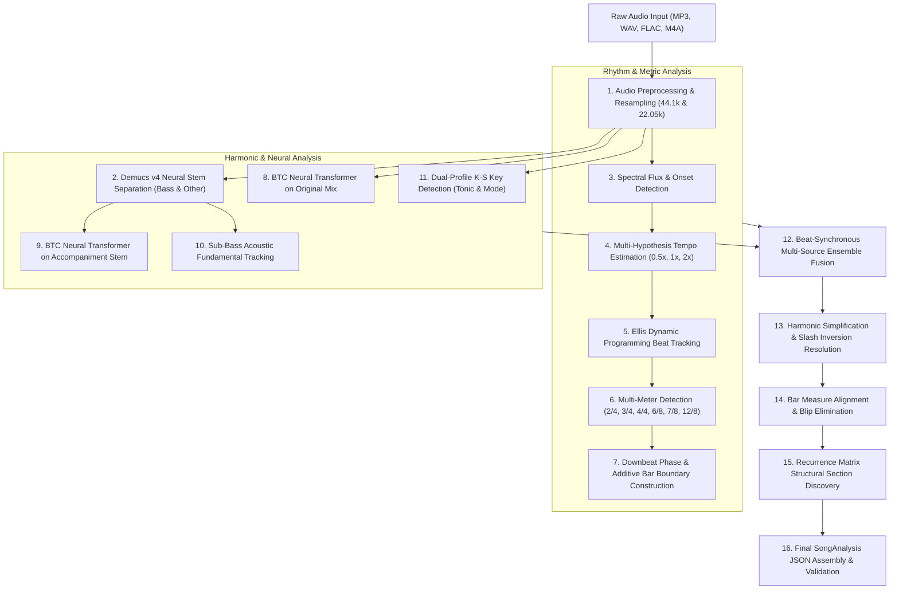

# Music Analysis Engine — Complete A–Z Technical Specification

This document provides an exhaustive, mathematical, and algorithmic breakdown of the 40 discrete stages comprising the authoritative Music Information Retrieval (MIR) and Automatic Chord Recognition (ACR) engine in Song Chord Analyzer.

---

## Stage-by-Stage Algorithmic Breakdown

### Stage 1: Audio Decoding
- **Input:** Raw audio file path (MP3, WAV, FLAC, M4A, AAC).
- **Algorithm:** Multi-backend decoding. Primary backend: `soundfile` (C libsndfile) for lossless PCM/WAV. Fallback: Bundled FFmpeg static binary via subprocess converting non-standard containers to raw 32-bit float WAV.
- **Library / Component:** `soundfile`, `subprocess` invoking `resources/ffmpeg/ffmpeg.exe`.
- **File & Function:** `backend/preprocessing/audio_processor.py` -> `AudioPreprocessor._load_audio()`.
- **Output:** Raw float32 NumPy array with range $[-1.0, 1.0]$ and native sample rate.
- **Parameters:** Peak threshold $\epsilon = 10^{-4}$.
- **Failure Modes:** Corrupt container headers, unsupported audio codecs; handled by raising `AudioProcessingError` with a user-friendly error message.

### Stage 2: Peak Normalization
- **Input:** Decoded raw audio buffer.
- **Algorithm:** Linear amplitude rescaling. Computes absolute peak amplitude $M = \max(|x|)$. If $M > 10^{-4}$, rescales signal: $x_{	ext{norm}} = x 	imes (0.95 / M)$. Pure silence is preserved.
- **Library:** `numpy`.
- **File & Function:** `backend/preprocessing/audio_processor.py` -> `normalize_audio()`.
- **Output:** Peak-normalized audio buffer with maximum absolute value exactly $0.95$.
- **Importance:** Prevents downstream saturation in neural models and ensures consistent CQT filterbank activation thresholds regardless of whether the original file was quiet or loud.

### Stage 3: Dual-Rate Resampling
- **Input:** Normalized audio signal.
- **Algorithm:** Polyphase Kaiser-windowed sinc interpolation resampler.
- **Library:** `scipy.signal.resample_poly` / `librosa.resample`.
- **File & Function:** `backend/preprocessing/audio_processor.py` -> `AudioPreprocessor.preprocess()`.
- **Output:** Two distinct standardized audio buffers:
  1. `stereo_44k`: 44.1 kHz, 2-channel stereo (required for Demucs source separation).
  2. `mono_22k`: 22.05 kHz, 1-channel mono (standard MIR sampling rate for CQT, BTC, and beat tracking).
- **Parameters:** `sr_high = 44100`, `sr_low = 22050`.

### Stage 4: Content Hashing & Metadata Extraction
- **Input:** Audio file path and decoded buffer.
- **Algorithm:** SHA-256 cryptographic digest of first 1 MB and last 1 MB of audio data, combined with audio duration, sample rate, and channel count.
- **Library:** `hashlib`.
- **File & Function:** `backend/preprocessing/audio_processor.py` -> `compute_audio_hash()`.
- **Output:** Hex string hash (e.g. `ecdbc4dd2a6d827b`) uniquely identifying audio content across uploads.
- **Importance:** Enables deterministic caching of Demucs stems, avoiding redundant stem separation when re-analyzing the same track.

### Stage 5: Sequential Stem Separation
- **Input:** `stereo_44k` audio buffer and audio content hash.
- **Algorithm:** Deep neural audio source separation using Demucs v4 hybrid transformer.
- **Library:** `demucs` (`htdemucs` pre-trained 4-stem model).
- **File & Function:** `backend/separation/demucs_separator.py` -> `DemucsSeparator.separate()`.
- **Output:** Two isolated stem audio files stored in `storage/stems/{hash}/`:
  - `bass.wav`: Isolated bass guitar, synth sub-bass, and low-frequency instruments.
  - `other.wav`: Isolated polyphonic accompaniment (keyboards, acoustic/electric guitars, synths) stripped of lead vocals and drums.
- **Hardware Optimization:** Wrapped with `VRAMManager.release_gpu()` to immediately delete the model from GPU memory and call `torch.cuda.empty_cache()` before chord recognition runs.

### Stage 6: Demucs StemKit / Model Lifecycle
- **Architecture:** `HTDemucs` uses a hybrid convolution and cross-domain Transformer operating in both time and frequency domains.
- **VRAM Envelope:** Peaks at ~3.2 GB VRAM on 44.1 kHz stereo chunks.
- **Caching Logic:** If `storage/stems/{hash}/bass.wav` and `other.wav` already exist on disk, separation is skipped completely (advancing progress directly from 15% to 40%).

### Stage 7: Constant-Q Transform (CQT) Feature Extraction
- **Input:** `mono_22k` audio buffer.
- **Algorithm:** Geometric filterbank where center frequencies are geometrically spaced ($f_k = f_0 \cdot 2^{k/b}$) and the ratio of center frequency to bandwidth ($Q$) is constant across all 144 bins.
- **Library:** `librosa.cqt`.
- **File & Function:** `backend/preprocessing/cqt.py` -> `extract_cqt()`.
- **Output:** Complex-valued spectrogram matrix $|X(k, t)|$ shape $(144, T)$ spanning 6 octaves from C1 (32.7 Hz) to B6 (1975.5 Hz) at 24 bins per octave.
- **Parameters:** `hop_length = 512` samples (~23.2 ms per frame), `fmin = 32.7 Hz`, `n_bins = 144`, `bins_per_octave = 24`.

### Stage 8: 12-Bin Chromagram Computation
- **Input:** 144-bin logarithmic CQT spectrogram.
- **Algorithm:** Folded octaves pitch integration: $	ext{Chroma}(c, t) = \sum_{o=0}^5 \left( |X(24o + 2c, t)| + |X(24o + 2c + 1, t)| 
ight)$ for pitch class $c \in \{0, \dots, 11\}$.
- **Library:** `backend/preprocessing/chroma.py`.
- **Output:** 12-dimensional chroma matrix normalized via L2-norm across pitch classes per frame.

### Stage 9: Spectral Flux Onset Detection Function
- **Input:** `mono_22k` audio buffer.
- **Algorithm:** Half-wave rectified first-order spectral difference: $	ext{SF}(t) = \sum_k H(|S(k, t)| - |S(k, t-1)|)$ where $H(x) = rac{x + |x|}{2}$.
- **Library:** `librosa.onset.onset_strength`.
- **File & Function:** `backend/beats/onset_detector.py` -> `compute_onset_envelope()`.
- **Output:** 1D continuous onset activation envelope sampled at 22.05 kHz / 512 hop (~43.06 Hz).

### Stage 10: Onset Peak Picking & Filtering
- **Input:** Continuous onset envelope.
- **Algorithm:** Adaptive local median thresholding: identifies frames where $	ext{SF}(t) > 	ext{median}(	ext{SF}_{t-w \dots t+w}) + \delta$.
- **File & Function:** `backend/beats/onset_detector.py` -> `pick_onsets()`.
- **Output:** Discrete list of onset timestamp candidates.

### Stage 11: Multi-Hypothesis Tempo Estimation
- **Input:** Onset activation envelope.
- **Algorithm:** Autocorrelation curve analysis with multiple candidate peak picking. Rather than committing to a single dominant tempo peak, the engine extracts candidate tempos across multiple octaves ($T_1, T_2 = 0.5 T_1, T_3 = 2.0 T_1$).
- **Library:** `backend/beats/tempo_estimator.py` -> `estimate_tempo_hypotheses()`.
- **Output:** `TempoInfo` object containing candidate BPMs, primary BPM, autocorrelation curve, and confidence scores.

### Stage 12: BPM Octave Disambiguation
- **Problem Solved:** Beat trackers frequently suffer octave errors (e.g. tracking an 86 BPM song at 172 BPM or 43 BPM).
- **Algorithm:** Evaluates harmonic rhythm transition rates and drum onset density to select the musically plausible base tempo before meter evaluation.

### Stage 13: Ellis Dynamic Programming Beat Tracking
- **Input:** Onset envelope and selected base tempo BPM.
- **Algorithm:** Dan Ellis's dynamic programming beat tracker maximizing:
  $$F^*(t) = O(t) + \max_{	au} \left( F^*(t-	au) - lpha (\log(	au / 	au_0))^2 
ight)$$
  where $	au_0$ is the target beat period ($60 / 	ext{BPM}$) and $lpha$ balances tempo consistency against onset alignment.
- **Library:** `librosa.beat.beat_track`.
- **File & Function:** `backend/beats/beat_tracker.py` -> `BeatTracker.track_beats()`.
- **Output:** Monotonically increasing array of beat timestamps $[t_0, t_1, \dots, t_{N-1}]$.

### Stage 14: Downbeat Phase Tracking
- **Input:** Beat grid and onset/bass energy.
- **Algorithm:** Evaluates downbeat phase alignment $\phi \in \{0, \dots, M-1\}$ maximizing the correlation between candidate downbeat pulses and low-frequency spectral energy.
- **File & Function:** `backend/beats/downbeat_tracker.py` -> `track_downbeats()`.
- **Output:** Subsequence of beat timestamps classified as measure beginnings (downbeats).

### Stage 15: Multi-Meter Detection (Core Metric Classifier)
- **Input:** `mono_22k` audio, beat grid, tempo hypotheses.
- **Algorithm:** Evaluates acoustic, harmonic, and rhythmic bar correlation across six distinct metric candidates: `2/4`, `3/4`, `4/4`, `6/8`, `7/8`, and `12/8`.
- **File & Function:** `backend/meter/meter_detector.py` -> `MeterDetector.detect_meter()`.
- **Output:** `MeterInfo` (numerator, denominator, display name, confidence, beat subdivisions).

### Stage 16: 2/4 Time Signature Evaluation
- **Structure:** 2 quarter-note beats per bar.
- **Metric Indicator:** Strong alternating downbeat/upbeat alternating energy in 2-beat cycles without 4-beat structural hierarchies.

### Stage 17: 3/4 Simple Triple Meter Evaluation
- **Structure:** 3 quarter-note beats per bar (Waltz / Triple time).
- **Metric Indicator:** Strong recurring energy every 3 beats ($O_t \gg O_{t+1}, O_{t+2}$).
- **Historical Milestone:** Corrected detection on *Bekhayali* (3/4 at 86.1 BPM), overriding the previous 4/4 misclassification (`docs/METER_TEMPO_FAILURE_REPORT.md`).

### Stage 18: 4/4 Common Quadruple Meter Evaluation
- **Structure:** 4 quarter-note beats per bar (standard pop/rock metric structure with secondary accent on beat 3).

### Stage 19: 6/8 Compound Duple Meter Evaluation
- **Structure:** 2 dotted-quarter macro beats divided into $2 	imes 3$ eighth notes.

### Stage 20: 7/8 Complex Additive Meter Evaluation
- **Structure:** 7 eighth-note pulses per measure.
- **Algorithm:** Multi-phase dynamic pulse evaluation testing asymmetric measure boundaries.

### Stage 21: 12/8 Compound Quadruple Meter Evaluation
- **Structure:** 4 dotted-quarter macro beats divided into $4 	imes 3$ eighth notes (standard blues/gospel slow triplet shuffle).

### Stage 22: 7/8 Subgrouping Classification
- **Algorithm:** Evaluates acoustic onset accents across the 3 classic additive metric divisions:
  1. $2+2+3$ (Daktilos pattern)
  2. $2+3+2$ (Kalamatianos pattern)
  3. $3+2+2$ (Makedonikos pattern)
- **Output:** Explicit subdivision string preserved in `MeterInfo.subdivisions` (e.g. `[2, 2, 3]`).

### Stage 23: Bar Boundary Construction
- **Input:** Beat grid and verified meter numerator.
- **Algorithm:** Partitions the continuous beat grid into consecutive musical measures (`Bar` objects), computing precise `start_time` and `end_time` for each measure.

### Stage 24: Krumhansl-Schmuckler Key Detection
- **Input:** Global chromagram averaged across the song.
- **Algorithm:** Correlates the 12-dimensional pitch class distribution against standard Krumhansl-Kessler cognitive key profiles for major and minor modes.
- **File & Function:** `backend/key/key_detector.py` -> `KeyDetector.detect_key()`.
- **Output:** `KeyInfo` (tonic note, mode, confidence).

### Stage 25: Major / Minor Dual Scoring & Confidence
- **Algorithm:** Computes correlation score and margin between best major key and best minor key. Implements triad concentration weighting to prevent relative major/minor confusion (e.g. C Major vs. A Minor).

### Stage 26: BTC Neural Network Architecture
- **Model:** Bidirectional Transformer for Chords (BTC).
- **Structure:** 8-layer Transformer encoder with multi-head self-attention operating over temporal frames.
- **File:** `backend/chord_recognition/btc_recognizer.py`, `models/btc/btc_model.py`.
- **Weights:** `models/btc/btc_model.onnx` (12.44 MB) and `btc_model_large_voca.pt` (11.66 MB).

### Stage 27: BTC Preprocessing
- **Input:** `mono_22k` audio.
- **Algorithm:** Extracts logarithmic CQT features matching the exact training normalization parameters: mean subtraction and standard deviation scaling per frequency bin.

### Stage 28: BTC Input Tensor Construction
- **Input Shape:** $(B, T, F)$ where $B=1$ (batch size), $T$ is time frames, and $F=144$ (CQT bins).
- **Execution:** Processed on CUDA GPU if available; otherwise falls back to multi-threaded CPU.

### Stage 29: BTC 170-Class Chord Vocabulary
- **Classes:** 168 tonal chords + 1 "No Chord" (`N`) + 1 "Out of Vocabulary" (`X`).
- **Breakdown:** 12 root pitch classes $	imes$ 14 chord qualities:
  - `maj`, `min`, `dim`, `aug`, `maj7`, `min7`, `7`, `dim7`, `hmin7` (half-diminished), `minmaj7`, `maj6`, `min6`, `sus2`, `sus4`.
- **File:** `backend/chord_recognition/vocabulary.py`.

### Stage 30: BTC Forward Inference & Posterior Probabilities
- **Algorithm:** Softmax activation over Transformer logits yields a $(T, 170)$ posterior probability matrix representing the probability distribution over all 170 chords for every 23.2 ms frame.
- **Dual Inference:** Executed twice per song:
  1. Once on the Original Mix (`mono_22k`).
  2. Once on the Vocal-Free Accompaniment Stem (`other.wav`).

### Stage 31: Sub-Bass Fundamental Extraction
- **Input:** Isolated `bass.wav` stem.
- **Algorithm:** Sharp low-pass Chebyshev filter ($f_c = 250 	ext{ Hz}$) isolates the physical bass register. Employs parabolic-interpolated autocorrelation to determine the sounding fundamental frequency $f_0(t)$ and maps it to the nearest MIDI note:
  $$p = 69 + 12 \log_2(f_0 / 440)$$
- **File & Function:** `backend/bass/inversion_detector.py` -> `BassStemAnalyzer.analyze_bass_track()`.

### Stage 32: Inversion Detection
- **Input:** Detected harmony chord root $R$, third $3^{	ext{rd}}$, fifth $5^{	ext{th}}$, and physical bass note $B(t)$.
- **Logic:**
  - If $B = R \pmod{12}$: Root position (standard chord).
  - If $B = 3^{	ext{rd}} \pmod{12}$: First inversion (e.g. C/E).
  - If $B = 5^{	ext{th}} \pmod{12}$: Second inversion (e.g. C/G).
  - If $B = 7^{	ext{th}} \pmod{12}$: Third inversion (e.g. C7/Bb).

### Stage 33: Slash Chord Formatting
- **Algorithm:** If sounding bass note $B$ differs from chord root $R$ with confidence $> 0.60$, formats chord display as `Root/Bass` (e.g. `D/F#`, `Am/G`).

### Stage 34: Passing-Bass Filtering
- **Algorithm:** Transient bass notes lasting less than 1.5 beat periods are classified as walking/passing bass lines and do not alter the underlying harmonic chord label.

### Stage 35: Beat-Synchronous Multi-Source Ensemble Fusion
- **Algorithm:** Combines predictions from Original Mix, Accompaniment Stem, and Bass Stem:
  $$P_{	ext{fused}}(c, b) = w_{	ext{mix}} P_{	ext{mix}}(c, b) + w_{	ext{other}} P_{	ext{other}}(c, b)$$
  where probabilities are pooled across beat windows $[t_{	ext{beat}_i}, t_{	ext{beat}_{i+1}}]$.
- **File & Function:** `backend/chord_recognition/btc_recognizer.py` -> `EnsembleChordAnalyzer.fuse_beat_probabilities()`.

### Stage 36: Temporal Smoothing
- **Algorithm:** Viterbi dynamic programming or median filter over beat predictions eliminates rapid spurious chord switching ("chatter").

### Stage 37: Simplicity Regularization
- **Algorithm:** If a complex chord (e.g. `Cmaj7`) has marginal probability advantage over its diatonic triad parent (`C`), the simpler triad is selected unless the 7th extension is acoustically prominent ($P_{	ext{ext}} > 0.40$).

### Stage 38: Bar Consolidation & Chord Snapping
- **Input:** Beat-synchronous chord sequence and bar boundaries.
- **Algorithm:** Consecutive identical chords within the same measure are consolidated. Chords spanning less than 0.5 beats are merged into dominant measure harmony, eliminating edge-overlap blips.

### Stage 39: Recurrence Matrix Structural Section Discovery
- **Input:** 12-bin chromagram and MFCC timbre features across measures.
- **Algorithm:** Computes cross-similarity recurrence matrix $R(i, j) = \cos(\mathbf{v}_i, \mathbf{v}_j)$ between bars. Diagonal path clustering segments the song into structural blocks with neutral labels (`SECTION A`, `SECTION B`, `INTRO`, `OUTRO`).
- **File & Function:** `backend/sections/section_detector.py` -> `SectionDetector.detect_sections()`.

### Stage 40: Final SongAnalysis JSON Assembly & Schema Validation
- **Input:** Metadata, tempo info, meter info, beat grid, bars, chords, sections, key info.
- **Algorithm:** Instantiates Pydantic `SongAnalysis` model and validates against `shared/music_schema/song_analysis.schema.json`. Returns complete JSON contract to caller.
