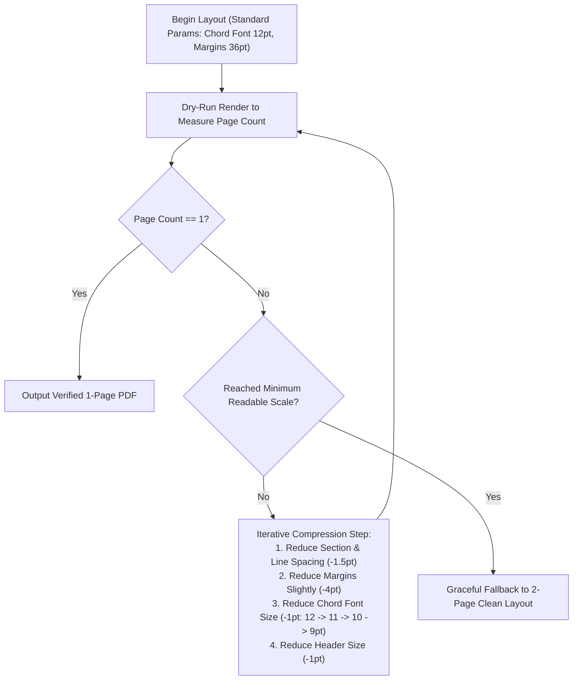

# Musician-Grade PDF & Lead Sheet Export

Song Chord Analyzer includes a dedicated document layout engine optimized for printed and tablet-readable **musician chord charts (lead sheets)**. It strictly avoids exporting raw mobile UI screenshots or bar-card grids.

---

## 1. Document Structure & Typography Hierarchy

A clean, compact lead-sheet layout:

```
Song Title
Key: D Major        Tempo: 136 BPM        Time: 7/8

INTRO:
| N | N | N | N |
| N | N | Asus4  D | D |

SECTION A:
| Dm | Asus4 | Asus4  D | D |
| Dm  Asus4  Dm  Asus4 | Dm  Asus4 | Asus4  D | D |

SECTION B:
| Dm  Gsus2  G | G  Gsus2  A# | A#  C  A# | A#  C  A#/G |
| A#  C/F  C | Bm  G/B  G | A#  F/A#  C  Gm | Gm/D  F/A  F/E  D |
```

### Formatting Rules:
1. **Header:** Clean title in bold (14–18 pt), followed by a single compact metadata line:
   `Key: <key>        Tempo: <bpm> BPM        Time: <meter>`
2. **Section Labels:** Bold uppercase headers (`INTRO:`, `SECTION A:`) with minimal top padding.
3. **Bar Measures:** Text-based measure delimiters (`|`). 4 bars per printed row (standard lead-sheet notation).
4. **Chords Inside Bars:** Formatted cleanly with intra-measure spacing. Preserves slash chord notation (`C/E`, `F/A`). Empty bars rendered as `| N |` or `| % |`.

---

## 2. Adaptive Measurement-Based Fit-to-Page Algorithm

### Core Requirement: **ONE SONG = ONE A4 PAGE**
Standard sheet music that spans 2 pages forces musicians to turn pages while playing an instrument. The export engine enforces an **adaptive measurement-based fitting algorithm** across both Android (`ExportService`) and Windows (`pdf_exporter.py`).



### Compression Priority Order:
1. Reduce section top/bottom padding (from 10 pt down to 3 pt).
2. Reduce vertical row line spacing (from 4 pt down to 1.5 pt).
3. Reduce page margins slightly (from 36 pt down to 24 pt).
4. Reduce chord font size incrementally: $12 	ext{ pt} 
ightarrow 11 	ext{ pt} 
ightarrow 10 	ext{ pt} 
ightarrow 9 	ext{ pt}$.
5. Reduce metadata header size slightly: $16 	ext{ pt} 
ightarrow 13 	ext{ pt}$.

**Readability Floor:** The font size is never reduced below $8.5 	ext{ pt}$. For exceptionally long songs ($> 200 	ext{ measures}$), the engine cleanly falls back to a 2-page document rather than creating unreadable micro-text.

---

## 3. Platform Implementations

### 3.1 Mobile Android (`ExportService.dart`)
- **Package:** Dart `pdf` package (`pdf: ^3.11.1`).
- **File:** `mobile/flutter_app/lib/services/export_service.dart`.
- **Method:** `ExportService.generatePdfBytes(SongAnalysis song)`.
- **Measurement Engine:** Performs layout calculation over document heights, testing candidate scales until total content height $\le 842 	ext{ pt}$ (A4 page height).

### 3.2 Windows Desktop & Server (`pdf_exporter.py`)
- **Library:** Python `reportlab` (`reportlab.platypus`, `reportlab.lib.styles`).
- **File:** `backend/export/pdf_exporter.py`.
- **Method:** `export_to_pdf(analysis, output_path)`.
- **XML Escaping:** Encodes all user and song strings with `xml.sax.saxutils.escape()` to prevent syntax errors on characters such as `<`, `>`, `&`.
