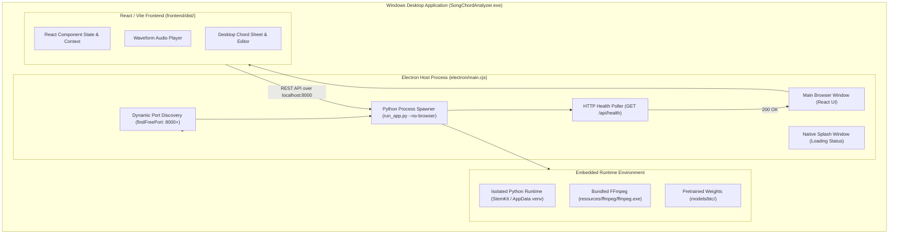

# Windows Desktop Architecture Blueprint

## 1. Executive Desktop Architecture

The Windows desktop application provides a standalone, zero-configuration executable environment. It packages an **Electron desktop shell**, a **React/Vite web user interface**, and the **authoritative Python MIR backend** into a unified distribution.



---

## 2. Electron Lifecycle & Process Management (`electron/main.cjs`)

### 2.1 Dynamic Port Discovery (`findFreePort`)
- To prevent port collision with other local services (such as development servers or Docker), `findFreePort(8000)` creates a temporary TCP server on port 8000. If port 8000 is occupied, it requests an ephemeral free port from the OS kernel.

### 2.2 Python Executable Resolution (`resolvePythonExecutable`)
The launcher locates the Python runtime by querying the following priority cascade:
1. Environment variable `SONG_CHORD_ANALYZER_PYTHON`.
2. Packaged Electron resources directory: `process.resourcesPath/python/python.exe`.
3. Local application resources directory: `resources/python/python.exe`.
4. Windows AppData isolated runtime: `%LOCALAPPDATA%/SongChordAnalyzer/venv/Scripts/python.exe` or `%APPDATA%/StemKit/venv/Scripts/python.exe`.
5. System PATH: `python.exe`.

### 2.3 Process Spawning & Health Polling
- Electron spawns the backend process:
  ```bash
  python run_app.py --port <port> --no-browser
  ```
- While Python initializes PyTorch, CUDA, and FastAPI, Electron displays a clean **native splash window**.
- Electron polls `http://127.0.0.1:<port>/api/health` every 250 ms.
- Once the backend reports `"status": "healthy"`, the splash window closes and the main browser window loads `frontend/dist/index.html?port=<port>`.

### 2.4 Graceful Process Termination
- When the user closes the desktop window, Electron intercepts `before-quit` and `window-all-closed`.
- On Windows, it issues a `taskkill /pid <pid> /f /t` command to ensure the Python process and any FFmpeg child processes terminate cleanly, preventing orphaned zombie processes.

---

## 3. Web Frontend Architecture (`frontend/`)

- **Tooling:** Built with **Vite 5.4**, **React 18**, and **TypeScript**.
- **State Management:** Reactive component state managing song upload, playback timeline, active chord indices, and transposition.
- **Waveform Synchronization:** Visual audio scrubber tracking current playback time and synchronizing with chord bar measure boundaries.
- **Styling:** Tailwind CSS with dark-mode optimized color tokens for high readability in stage and studio environments.

---

## 4. Windows Reference Engine (`backend/pipeline.py`)

The Windows backend implementation is the **authoritative gold-standard reference** for the entire project:
- Uses PyTorch with native NVIDIA CUDA acceleration on the host GPU.
- Directly invokes Demucs v4 hybrid transformer for 4-stem source separation.
- Runs the complete BTC Transformer model with 170 chord classes.
- Tracks sub-bass register fundamentals ($< 250 	ext{ Hz}$) on the isolated bass stem to resolve slash chord inversions (e.g. `C/E`, `G/B`).
- **Parity Validation:** Validated with 100% mathematical parity against the FastAPI server on *Bekhayali* (`WINDOWS_SERVER_PARITY_REPORT.md`).

---

## 5. Packaging & Distribution Configurations

- **Tool:** `electron-builder` configured via `electron-builder.yml`.
- **Application Icon:** `build/app.ico` (256x256 multi-resolution icon).
- **Distribution Outputs:**
  1. **NSIS Setup Installer:** `dist_electron/SongChordAnalyzer-Setup.exe` (142.78 MB). Provides desktop shortcut, start menu entry, and clean uninstaller.
  2. **Portable Executable:** `dist_electron/SongChordAnalyzer.exe` (142.57 MB). Standalone portable package requiring no administrative installation rights.
